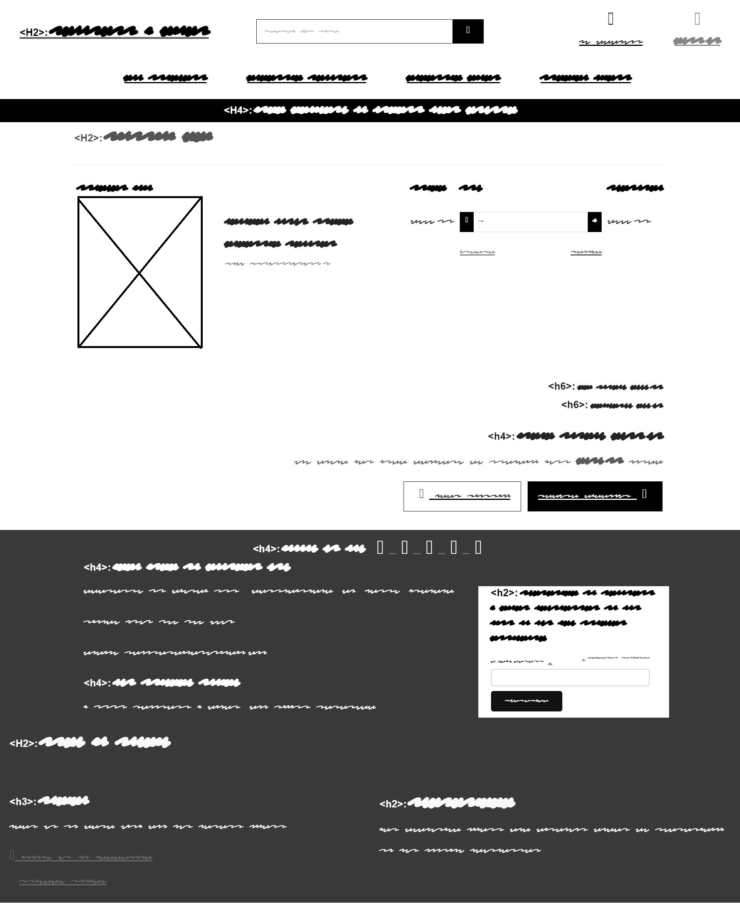
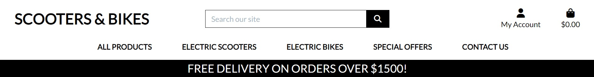

# SCOOTERS & BIKES #

* I launched ScootBikeSpot as a B2C e-commerce platform because I noticed a growing demand for scooters and bikes among consumers. As a passionate enthusiast myself, I wanted to create a convenient and reliable online destination where individuals can easily find and purchase their ideal two-wheeled vehicles. By focusing on the B2C model, I aim to directly connect with customers and provide them with a seamless shopping experience tailored to their needs and preferences. Through ScootBikeSpot, I'm committed to offering top-notch products, excellent customer service, and exclusive benefits to enhance the overall satisfaction of every rider.


The live version of the website is available for you here : <a href="https://scooter-bike-ecommerce-pp5-fa03149f5b15.herokuapp.com/" target="_blank">SCOOTERS & BIKES</a>

# README CONTENTS #

* ## [UX](#ux-1)

  * [User Stories](#user-stories)
  * [Agile Methodologies](#agile-methodologies)
  * [The Scope](#1-scope)
  * [Structure](#2-structure)
  * [Skeleton](#3-skeleton)
  * [Surface](#4-surface)

* ## [E-Commerce Model](#e-commerce-model-1)

  * [Business Owners Goals](#business-owner)
  * [Project Goal](#project-goals)
  * [Social Media](#social-media)
  * [Marketing](#marketing)
  * [Newsletter](#newsletter)

* ## [Search Engine Optimization](#search-engine-optimization---seo)

  * [Meta](#meta-descriptions)
  * [Sitemap](#sitemap-file)
  * [Robots](#robots-file)

* ## [Testing](#testing-1)

  * [Testing Documentation](#testing-documentation)
  * [Defensive Programming](#defensive-programming)

* ## [Deployment](#deployment-1)

  * [Setting Up](#setting-up)
  * [Initial Installations](#initial-workspace-installations)
  * [Database Setup](#database-setup)
  * [AWS Setup](#amazon-web-services--aws)
    * [S3](#s3-buckets)
    * [Adjust Bucket Policy](#adjust-bucket-policy)
    * [Create IAM User/UserGroup](#create-user-and-user-group-in-iam)
    * [Create Media Folder](#create-media-folder)
    * [AWS to Django](#aws-to-django)
  * [Project Settings Adjustments](#project-settings-adjustments)
  * [Heroku Deployment](#heroku)
  * [GitHub Extras](#github-extras)
    * [How to Fork](#how-to-fork)
    * [How to Clone](#how-to-clone)

* ## [Technologies Used](#technologies-used-1)

  * [Languages Used](#languages)
  * [Frameworks / Libraries](#frameworks--libraries--programs)

* ## [Credits](#credits-1)

  * [Coding](#coding)

# UX #

## User Stories ##

* Site Owner Goals :
  
  * Create a visually appealing and professional website design to attract users
  * Implement a user-friendly and intuitive interface for easy navigation
  * Enable user account management and access control
  * Provide tools for managing and moderating user-generated content
  * Develop a responsive design that works seamlessly on various devices
  * Establish effective communication channels to interact with users and offer support.

* User Goals :

  * Allow users to create accounts and have control over their information
  * Provide a straightforward and efficient browsing experience for content discovery
  * Delivery a responsive and user-friendly design that functions well on all devices
  * The ability to add/edit/remove/update items in the shopping cart

User Stories :


By pursuing these objectives, Scooters & Bikes Shop strives to craft a captivating and user-centered journey for both the shop owner and customers, ensuring satisfaction and effortless engagement with the platform.

<hr>

# Agile Methodologies #

During the development of the Scooters & Bikes Shop, all features were carefully categorized into three tiers: Must-Have, Should-Have, and Could-Have.

Must-Have features were prioritized for implementation as they formed the core functionalities essential for the shop's operation. These included critical elements such as user registration, product browsing, and checkout.

Should-Have features were considered important but not crucial for the initial release. These functionalities, such as user reviews and advanced search options, were prioritized after the completion of Must-Have features.

Could-Have features were desirable but not necessary for the initial release. These included enhancements like social media integration and personalized recommendations, which were planned for future iterations of the shop.

By categorizing features into these tiers, we ensured a systematic and efficient development process, focusing on delivering core functionalities while leaving room for future enhancements and improvements.

GitHub Project WorkFlow :


<hr>

# 1. Scope #

Scooter & Bike Shop is an e-commerce platform specializing in providing a diverse selection of scooters and bikes. Our goal is to create a fully functional and user-friendly online store where customers can effortlessly browse, purchase, and manage their orders. With a focus on quality, convenience, and customer satisfaction, Scooter & Bike Shop is dedicated to offering an exceptional shopping experience for all scooter and bike enthusiasts.

# 2. Structure #

# Scooters & Bikes Shop

## Features and Functionality

### User Registration and Authentication

- Customers can easily register and log in to their accounts.
* Robust authentication mechanisms ensure secure and personalized experiences.

### Product Catalog

- Present a comprehensive catalog of scooters and bikes.
* Organize products by price, name, ratings, and more.
* Detailed product information including specifications, images, and ratings.

### Shopping Cart and Checkout

- Seamless shopping cart functionality for adding and managing products.
* Secure checkout process for collecting address and payment information.
* Integration with Stripe payment gateway for safe transactions.

### Order Management

- View and track order history, including order details and total cost.

### Search and Filtering

- Powerful search functionality to find products based on keywords or specific criteria.
* Filtering options to refine product search results by attributes.

### Responsive Design

- Fully responsive website for optimal user experience across all devices.
* Ensures seamless navigation and readability on desktops, tablets, and mobile devices.

### Admin Panel

- Admin panel for managing products, orders, and user accounts.
* Inventory management capabilities, including stock updates and product management.

### Profile Page

- User profile page for updating delivery information and tracking orders.

### Contact Us

- Contact form for users to reach out to site administrators or customer support.
* Efficiently collect user inquiries, feedback, and issues for quick response and resolution.

# 3. Skeleton #

Here's the foundational wireframe for our Scooters & Bikes Shop website layout. This template serves as the starting point for our design journey, guiding the creation of additional templates with a cohesive and user-friendly design.




Here is the Entity-Relationship Diagram (ERD) for the project :

.jpg)

# 4. Surface #

## Scooters & Bikes Shop Color Palette ##

Here's the primary palette of colors used throughout the Scooters & Bikes Shop project. These vibrant colors complement each other and work together harmoniously.

You can view the color palette [here](https://alwane.io/scooter-bike-ecommerce-pp5-fa03149f5b15.herokuapp.com/kz9sJs2023pYHtASAjUwt56ci07ZKslU).


## Layout ##

The layout of the Scooters & Bikes Shop website is designed to be responsive and user-friendly across various devices, thanks to Bootstrap! The website utilizes the Bootstrap framework to ensure a consistent and visually appealing experience. The layout elements are:

1. Header:
    * The header section is sticky to the top of the screen, providing easy navigation and access to essential features wherever you may be on the page.
    * The Scooters & Bikes Shop logo is prominently displayed, along with navigation links to different sections of the website.
    * The header also includes additional elements such as a search bar, user account options, and a shopping cart.

    

<hr>

2. Hero Section:
    * The Hero section showcases a visually appealing image related to scooters and bikes.
    * It features a compelling headline and a call-to-action button to encourage users to start exploring the products the website has to offer.

    

<hr>

3. Products Page:
    * Products are presented in a grid format, allowing users to browse through different categories and options.
    * Each product listing includes key information such as product name, image, price, and rating.
    * Users can click on a product to view more details, including specifications and a quantity input for however amount of items they desire.
    * The edit and delete ability is strictly available for the site administrator only.

    

<hr>

4. Shopping Cart and Checkout:
    * A user-friendly shopping cart interface allows customers to add products, adjust quantities, and proceed to checkout.
    * The checkout process includes collecting necessary information like shipping address and payment details.
    * Users are guided through the steps and provided with clear instructions to complete their purchase securely.

    
    

<hr>

5. Footer:
    * The footer section appears at the bottom of the page, featuring essential site information such as contact details and links to important pages.

    

6. Profile Page:
    * This section allows the user to manage their delivery information, track their Order History/Order Number/Items and date.

    

Overall, the layout of the Scooters & Bikes Shop website aims to provide a visually appealing and intuitive user interface, ensuring that users can easily navigate, explore, and engage with the wide range of scooters and bikes offered by the store.

* [Back to Top](#readme-contents)

# E-Commerce Model #

Scooters & Bikes Shop is an e-commerce platform specializing in selling high-quality scooters and bikes to consumers. Our mission is to provide customers with top-of-the-line two-wheeled vehicles that deliver exceptional performance, reliability, and value. Our target market includes both scooter and bike enthusiasts, as well as professionals in need of reliable transportation options. We cater to individuals who value superior design, functionality, and the latest advancements in mobility technology. This Business to Consumer model is designed to be simple yet intuitive for the consumer, with the option to sign up for newsletters featuring potential deals and more.

# Business Owner #

The business owner's goal is to establish a successful e-commerce platform for selling scooters and bikes. They aim to expand their customer base by offering a visually appealing website with a seamless and secure payment system. The owner also wants to have the ability to manage product inventory and make updates or changes through a secure and interactive front-end interface. Given the competitive landscape, the business owner recognizes the importance of standing out and providing exceptional customer service.

# Project Goals #

Scooters & Bikes Shop is my final Portfolio Project for Code Institute's Diploma in Full Stack Software Development (E-Commerce Applications). It is a Full Stack website focused on implementing business logic to manage a centralized database.

# Social Media #

## Marketing ##

Here I have created a Social Media Marketing Page for the Scooters & Bikes Shop. It is a fantastic way to boost engagement and increase sales within the business. Here is a screenshot of the whole page available to anyone.


## Newsletter ##

I have also included a Mailchimp service into the website that handles newsletter automation for customers. It contains deals, special offers, new products, and more. Anyone can sign up hassle-free by entering their email address in the input box provided.


* [Back to Top](#readme-contents)

# Search Engine Optimization - SEO #

## Meta Descriptions ##

To ensure effective search engine crawling, I've provided relevant meta keywords and descriptions throughout the project.

## Sitemap File ##

I utilized Code Institute's recommended XML-Sitemaps generator to create the `sitemap.xml` file, which has been included in the root directory of this project. The sitemap.xml file is generated using the live deployed site.
[SitemapXML](./templates/sitemap.xml)

* Link to Live Site: [Scooters & Bikes Shop](https://scooter-bike-ecommerce-pp5-fa03149f5b15.herokuapp.com)

## Robots File ##

Here's the snippet of the `robots.txt` file for this project:


<hr>

* [Back to Top](#readme-contents)

# Testing #

## Testing Documentation ##

* I have created a seperate markdown documentation for the testing of this project.
  * You can view the testing here : [Testing.MD](./TESTING.md)

## Defensive Programming ##

* The project has been implemented with the necessary features here to have the utmost safety in regards of data/access to forbidden areas. There's User authentication and authorization implemented in all areas and more areas are protected using the 'Login_required' decorators. Django auth is a very well built system that has that additional layer of authentication/security..

* [Back to Top](#readme-contents)

# Deployment

## Setting Up

### Creating the Workspace Project Repository

1. Open Visual Studio Code (VSC).
2. Click on the "Source Control" icon on the left sidebar.
3. Click on the "Clone Repository" button.
4. Select "Clone from GitHub" from the dropdown menu.
5. Choose "HTTPS" as the remote URL selector.
6. Enter the URL: `https://github.com/Code-Institute-Org/gitpod-full-template.git`.
7. Choose a local path where you want to clone the repository.
8. Click "Clone Repository" to create the workspace project repository.

## Initial Workspace Installations

Here are the steps to install the necessary frameworks/packages:

1. **Installation of Django:**

    ```bash
    pip3 install django==3.2
    ```

2. **Installation of Gunicorn:**

    ```bash
    pip3 install gunicorn
    ```

3. **Installation of Libraries:**

    ```bash
    pip3 install dj_database_url
    pip3 install psycopg2-binary
    ```

4. **Create the Requirements File:**
    * Run the following command to create the requirements file with the installed libraries/packages:

    ```bash
    pip3 freeze --local > requirements.txt
    ```

5. **Create Your Project:**
    * Run the following command to create your project:

    ```bash
    django-admin startproject (PROJECT_NAME) .
    ```

    * Make sure to include the full stop at the end.

6. **Create Your App:**
    * Run the following command to create your app:

    ```bash
    python3 manage.py startapp (APP_NAME)
    ```

    * Once you've created your app, make sure to add it to your settings.py under the section of INSTALLED_APPS.

7. **Run Migrations:**
    * Make your migrations by running:

    ```bash
    python3 manage.py makemigrations
    ```

    * It's also a good idea to run a dry run migration for a pre-flight check:

    ```bash
    python3 manage.py makemigrations --dry-run
    ```

    * Migrate your changes to the database:

    ```bash
    python3 manage.py migrate
    ```

    * Test your website locally by running:

    ```bash
    python3 manage.py runserver
    ```

8. **Create Your env.py File:**
    * Create your env.py file in the root directory.

## Database Setup ##

Next, you need to create a database to store all your data. This project is built on the ElephantSQL database, which you can find [here](https://www.elephantsql.com/). Follow these steps for setup:

1. Head to the website and login or create an account (I signed in using GitHub).
2. Create a new instance.
3. Choose the plan, selecting the Tiny Turtle (Free Plan).
4. Select the Region closest to your location.
5. Once the instance is created, click on your database to access your dashboard.
6. Here, you'll find a DATABASE_URL for your ElephantSQL database. Copy this URL and set it up in your project.
7. Add the copied URL into your env.py file in the root directory as follows:

        import os

        os.environ["DATABASE_URL"] = ("postgres://your-database-url")

## Amazon Web Services (AWS) ##

Here, we set up media/static storage for our project using AWS. Follow these steps:

### S3 Buckets ###

1. Search for S3 in the AWS console.
2. Create a new bucket, matching your Heroku project name, and select your region.
3. Uncheck "Block all public access".
4. Enable ACLs under "Object Ownership" and select "Bucket owner preferred".
5. Under the "Properties" tab, activate static website hosting and set "index.html" and "error.html".
6. Paste the provided CORS configuration under the "Permissions" tab:

        [
            {
                "AllowedHeaders": ["Authorization"],
                "AllowedMethods": ["GET"],
                "AllowedOrigins": ["*"],
                "ExposeHeaders": []
            }
        ]

7. Note your ARN string.

### Adjust Bucket Policy ###

1. Go to "Bucket Policy" and select "Policy Generator".
2. Set "Policy Type" as "S3 Bucket Policy", "Effect" as "Allow", "Principal" as "*", and "Actions" as "GetObject".
3. Paste your ARN into the "Amazon Resource Name(ARN)" field.
4. Generate the policy, copy it, and paste it into the Bucket Policy Editor.
5. Append "/*" to the end of the "Resource" key before saving.
6. Enable "List" in the ACL (Access Control List) for Everyone.

### Create User and User Group in IAM ###

1. Open IAM (Identity and Access Management) service.
2. Create a new user group (e.g., "group-your-app-name").
3. Attach the "AmazonS3FullAccess" policy to your group.
4. Review and create the policy.
5. Attach this policy to your group.
6. Add a new user to the group, selecting "Programmatic Access". Download the .csv file with the user's Access key ID and Secret Access Key.

### Create Media Folder ###

1. In S3, create a new folder called "media" to hold your image files.
2. Upload the required files for your project into this folder.
3. Set "Manage Public Permissions" to "Grant Public Read Access to this object(s)".

### AWS to Django ###

1. Install the required packages:

        pip3 install boto3
        pip3 install django-storages

2. Add 'storages' to the INSTALLED_APPS in settings.py.
3. Add your AWS secret variables to the env.py file.

### Project Settings Adjustments ###

1. Import required modules in settings.py.
2. Set your secret key.
3. Configure the database settings.
4. Configure static and media files settings.
5. Add required imports and configurations to your URLS.py.
6. Set up AWS configurations.
7. Create custom_storages.py file.
8. Create Procfile in the root directory.
9. Adjust your allowed hosts.

At this stage, commit and push your changes to your GitHub repository using the following commands:

    1. git add .
    2. git commit -m "Commit Message"
    3. git push

* [Back to Top](#readme-contents)

## HEROKU ##

To deploy our project on [Heroku](https://heroku.com/), follow these final steps:

1. Go to the [Heroku](https://heroku.com/) website.
2. Create a New App with a unique name.
3. In the settings tab of your Project, click "Config Vars".
4. Set all your configurables:

        - DATABASE_URL: Your ElephantSQL database URL
        - SECRET_KEY: Your Django secret key
        - AWS_ACCESS_KEY_ID: Your AWS Access Key ID
        - AWS_SECRET_ACCESS_KEY: Your AWS Secret Access Key
        - USE_AWS: True

    *Use a Django Secret Key generator to generate a secret key for your project for security.*

5. Link your GitHub repository with your Heroku app in the Deploy tab by clicking the GitHub Icon and searching for your repository name.
6. Optionally, enable automatic deploys for seamless updates whenever you push changes to your GitHub repository.

## GitHub Extras ##

### How to Fork ###

Forking a repository creates a separate copy of the original repository, including all its code, branches, commits, and related information.

Steps:

1. Log into GitHub and locate the desired repository.
2. Click the grey Fork button at the top of the repository.
3. After forking, you will have a copy of the original repository.

### How to Clone ###

Cloning a repository creates a complete copy of its code, history, branches, and other associated files, allowing you to work with the code locally and synchronize changes with the remote repository on GitHub.

Steps:

1. Navigate to the repository on GitHub.
2. Click on the green code button and select the 'HTTPS' tab.
3. Copy the HTTPS link.
4. Open your terminal and change the directory to where you want to clone the repository.
5. Type 'git clone' followed by the copied HTTPS link.
6. Press enter, and the repository will clone to your local machine for development.

* [Back to Top](#readme-contents)

# Technologies Used #

* ## Languages ##

  * HTML
  * CSS
  * Python
  * jQuery
  * JavaScript

* ## Frameworks / Libraries / Programs ##

  * [Django (Python web Framework)](https://www.djangoproject.com/)
  * [jQuery (Javascript Library)](https://jquery.com/)
  * [Bootstrap (Front-End Library)](https://getbootstrap.com/)
  * [Django-Crispy-Forms (Django Form Rendering Library)](https://django-crispy-forms.readthedocs.io/en/latest/)
  * [Psycopg2-Binary (PostgreSQL database adapter for Python)](https://pypi.org/project/psycopg2/)
  * [Balsamiq Wireframes (Wireframe Software to sketch initial design)](https://balsamiq.com/wireframes/?gclid=CjwKCAjw0N6hBhAUEiwAXab-TS4-B3FwE_NpeSWRL6jqqSJMnuxinyknl1t_ddtaW_Jd3UAOvbxguhoC4agQAvD_BwE)
  * [GitHub (Version Control alongside a Local Development Enviroment)](https://github.com/)
  * [Font Awesome (Library of Icons)](https://fontawesome.com/)
  * [ElephantSQL (Hosting service for the database for this application)](https://www.elephantsql.com/)
  * [AWS Amazon Hosting Service](https://aws.amazon.com/)
  * [Heroku (Application hosting service)](https://heroku.com/)
  * [Lucidchart (Online Application for Flowcharts/Diagrams)](https://www.lucidchart.com/pages/)
  * [Mailchimp (Email Newsletter Automation)](https://mailchimp.com/)
  * [Stripe (Payment Processing Platform)](https://stripe.com/ie/)

  <hr>

* [Back to Top](#readme-contents)

# Credits #

### Coding and Guidance ###

* [Google](https://google.com)
* [AMI Responsive](https://ui.dev/amiresponsive)
* [Stack Overflow](https://stackoverflow.com/)
* [YouTube](https://youtube.com)
* [W3Schools](https://w3schools.com)
* [Code Institute](https://https://codeinstitute.net/) - Provided comprehensive course materials and guidance throughout the project.
* [Boostrap Documentations](https://getbootstrap.com/docs/5.3/getting-started/introduction/)

All those resources were very valuable in the progression of my project whenever I was stuck at any point in time I referred back to the course material as well as the online resources.

All my images were sourced from Google Images, and any copyrights are reserved for the owners as these are just for display purposes only.

I would especially like to thank Code Institute for supplying me with the necessary guidance for this project. The comprehensive course materials and mentor support have been invaluable throughout the development process.

Also big thank you to Tutor Assistance at times where I really needed assistance with a bug/issue.

I have went along the walkthrough projects and also used the full Gitpod template provided by them, which in all they have helped greatly.

* [Back to Top](#readme-contents)
