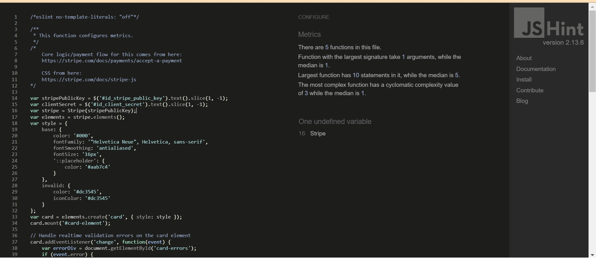

# Scooters & Bikes Shop - Testing
[Click here to go back to the README.md file](README.md)

Here is the documentation containing all the testing carried out in this project.

## Testing Contents

* [Manual Testing](#manual-testing)
    * [Navbar](#navbar--screenshot)
    * [Bag](#bag--screenshot)
    * [Checkout](#checkout--screenshot)
    * [Profile](#profile--screenshot)
    * [Admin](#admin--screenshot)
    * [Products](#products--screenshot)
    * [Footer](#footer--screenshot)
    * [Home Page](#home-page--screenshot)
    * [Login Page](#login-page--screenshot)
    * [Signup Page](#signup-page--screenshot)
* [Validators](#automated-testing)
    * [W3C HTML Validations](#w3c-html-validations)
    * [W3C CSS Validator](#w3c-css-validations)
    * [CI Python Linter](#ci-python-linter)
    * [JS Test](#js-test) 
    * [Lighthouse SEO](#lighthouse-seo)
* [Website Responsiveness](#website-responsiveness)
* [Bugs / Issues](#bugs--issues)

## Manual Testing

Here I have completed manual testing of the site's functions and accessed certain points as a user and non-user. I will attach the tests that were done and tested to the best extent possible.
1. Navbar : 

2. Bag : 

3. Checkout : 

4. Profile : 

5. Admin : 

6. Products : 

7. Footer : 

8. Home Page : 

9. Login Page : 

10. Signup Page : 

## Validators

### W3C HTML Validations

1. Bag Page Validation Result : 

2. Home Page Validation Result : 

3. Products Page Validation Result : 

4. Profile Page Validation Result : 

### W3C CSS Validations

1. Bag Page Validation Result: 

2. Home Page Validation Result: 

3. Products Page Validation Result: 

4. Profile Page Validation Result: 

### CI Python Linter

* Code Institue Python linter, all these files were put through the tester and nothing of major came up. Here are the results :

CI Python Linter

1. Bag Contexts: 

2. Bag Views: 

3. Checkout Admin: 

4. Checkout Forms: 

5. Checkout Models: 

6. Checkout Views: 

7. Checkout Webhook Handler: 

8. Checkout Webhooks: 

9. Products Views: 

10. Products Admin: 

11. Products Forms: 

12. Products Models: 

13. Profiles Forms: 

14. Profiles Models: 

15. Profiles Views: 

16. Scooter Bike Ecommerce Settings: 

### JS Test

1. Test JS Country Field: 

2. Test JS Stripe Elements: 

### Lighthouse SEO

I have completed a series of lighthouse tests for the SEO of the site and other aspects.

1. Bag Page: 

2. Homepage: 

3. Products Page: 

4. Profile Page: 

* From these tests I can see that performance wise the website could be initially improved, most likely it is due to image sizing/formats. I think with further optimizations the website can achieve fantastic results here.

## Website Responsiveness

Bootstrap, a powerful front-end library, was extensively utilized in developing the website, providing numerous features for content alignment. The website underwent testing across various devices, ensuring optimal performance. Chrome Development tools were employed to make necessary adjustments for compatibility with a wide range of devices.

## Bugs / Issues

Here I document any known bugs or issues currently present on the site.

1. Dropdown Menu Overflow: On smaller screen sizes, the text in the dropdown menu from the "My Account" navbar overflows off the screen due to its length. Although it's mainly a visual issue, it needs attention for better user experience.

2. Sorting and Filtering Bugs: Attempting to fix the sorting by price filter on the products page has resulted in another bug: the sorting by ratings doesn't work properly. Additionally, other filter types need adjustments to better suit the products, as they are not functioning as intended, apart from pricing from low to high or high to low. This issue requires immediate attention for smoother navigation and user experience.

Any further issues upon inspection and review will be noted here. I am dedicated to keeping this site free of any issues to provide the best experience for users as possible.
